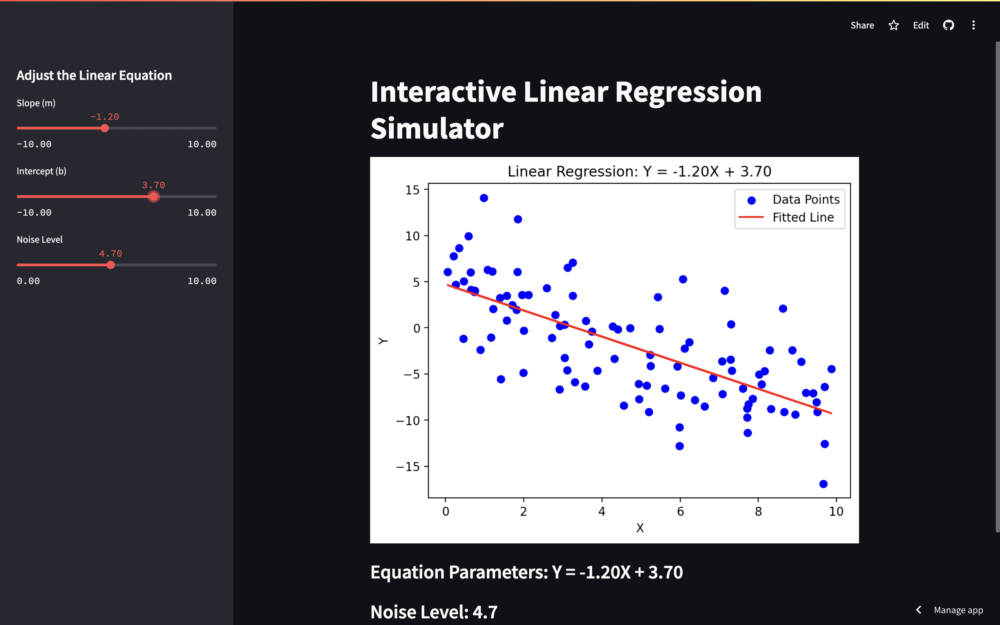

# 線性迴歸互動應用程式

此應用程式已經部署到 Streamlit Cloud。
你可以透過以下連結來查看並互動操作該應用程式：
**[線性迴歸應用程式](https://linear-regression-popo.streamlit.app/)**

這是一個基於 [Streamlit](https://streamlit.io/) 的互動應用程式，用於模擬和視覺化線性迴歸模型。使用者可以調整線性方程的斜率、截距以及噪音大小，並即時查看隨機散佈點與迴歸擬合線的變化。

---

## 功能

- 使用者可以透過側邊欄調整：
  - **斜率 (m)**: 調整回歸線的傾斜程度
  - **截距 (b)**: 調整回歸線的偏移量
  - **噪音水平**: 增加或減少隨機點數據中的噪音
- 即時更新的圖表顯示隨機生成的數據點與擬合的迴歸線
- 提供動態方程顯示，根據用戶的輸入變動

---

## 外觀



---

## 如何運行應用程式

### 1. 安裝需求套件

首先，請確保已經安裝好所需的 Python 套件。在專案目錄下執行以下指令來安裝 `requirements.txt` 中列出的套件：

```bash
pip install -r requirements.txt
```

### 2. 運行應用程式

執行下列指令以啟動應用程式：

```
streamlit run linear_regression_app.py
```

### 3. 在瀏覽器中查看

執行後，應用程式會在本地瀏覽器中打開，網址通常是 http://localhost:8501。

---

### 專案結構

1. linear_regression_app.py: 應用程式的主要 Python 程式碼
2. requirements.txt: 列出了應用程式所需的依賴套件
3. README.md: 專案介紹與說明文件
4. Dependencies：Streamlit, Matplotlib, Scikit-learn, Numpy

---
